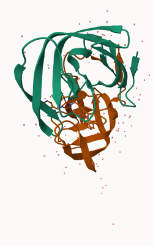
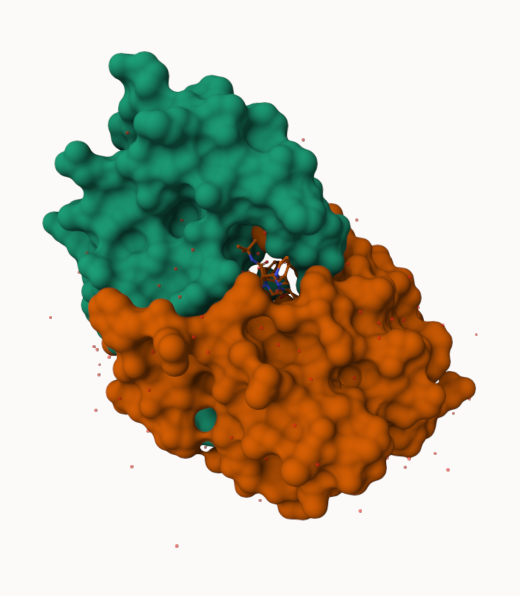
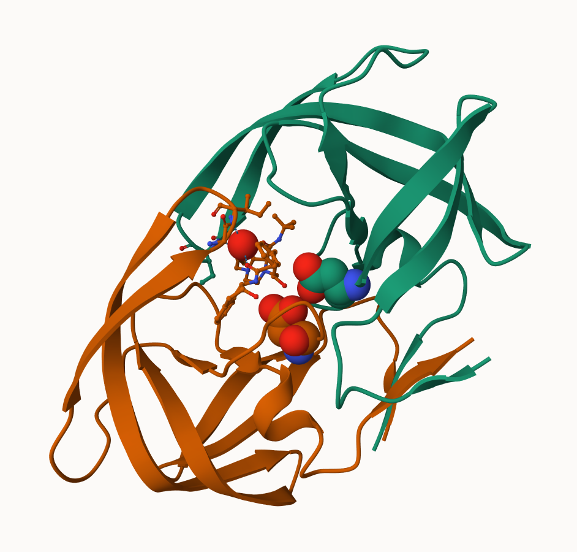

## Background

The main repository of high-resolution structural data on biomolecules is called the **Protein Data Bank** (PDB).

## PDB Statistics

What is in the PDB in terms of molecule type and structure determination method?

Read a CSV file of current PDB stats obtained from https://www.rcsb.org/stats/summary

```{r}
pdb <- read.csv("Data Export Summary.csv")
pdb
```

> Q1: What percentage of structures in the PDB are solved by X-Ray and Electron Microscopy.

80.49% of structures in the PDB are solved by X-Ray and 13.38% by Electron Microscopy.

```{r}
pdb$X.ray
```

```{r}
pdb$Neutron
```
This print out above `pdb$X.ray` is "character" not "numeric". Therefore I can't do math with it. We need to fix this...


```{r}
# We want to get rid of (or sub out) commas:
x <- pdb$X.ray
tmp <- sub(",", "", x=pdb$X.ray)
sum( as.numeric(tmp) )
```

We could make a function to do this:

```{r}
rm.comma <- function(x) {
  tmp <- gsub(",", "", x)
  sum( as.numeric(tmp) )
}
```

```{r}
n.tot <- rm.comma(pdb$Total)
n.xray <- rm.comma(pdb$X.ray)
n.em <- rm.comma(pdb$EM)

n.xray/n.tot * 100
n.em/n.tot * 100
```

We could also use a different import function `read_CSV()` for this CSV that speaks American (i.e. deals with commas in numbers in a comma seperated value file).


```{r}
library(readr)

read_csv("Data Export Summary.csv")
```

```{r}
n.tot <- sum(as.numeric(gsub(",", "", pdb$Total)))
n.xray <- sum(as.numeric(gsub(",", "", pdb$X.ray)))
n.em <- sum(as.numeric(gsub(",", "", pdb$EM)))

n.xray / n.tot * 100
n.em / n.tot * 100
(n.xray + n.em) / n.tot * 100

```

> Q. How many total protein structures are there in the dataset?

```{r}
pdb$Total[1]
```

The total number of protein sequences in UniProt is 202,556,314

```{r}
217315/202556314 * 100
```

> **Key-point**: We have a very, very small structural coverage of known proteins (~0.1%). Most structures we know about (~%80) come from one method (X-ray crystalography).

> Q2: What proportion of structures in the PDB are protein?

```{r}
# Remove commas and convert to numeric
rm.comma <- function(x) {
  tmp <- gsub(",", "", x)
  as.numeric(tmp)
}

# Convert Total column
total <- rm.comma(pdb$Total)

# Protein is the first row
n.protein <- total[1]
n.total <- sum(total)

# Proportion of PDB structures that are protein
n.protein / n.total * 100
```
Approximately 85.9% of structures in the PDB are protein.

> Q3: Type HIV in the PDB website search box on the home page and determine how many HIV-1 protease structures are in the current PDB?

Searching “HIV-1 protease” in the PDB returns 1,227 structures.


## Visualizing PDB Data

Main strand alone web version with all features is at https://molstar.org/viewer/




> Q4: Water molecules normally have 3 atoms. Why do we see just one atom per water molecule in this structure?

In X-ray crystal structures, hydrogen atoms are usually not resolved because they are too small and have low electron density, so only the oxygen atom of each water molecule is visible.

> Q5: There is a critical “conserved” water molecule in the binding site. Can you identify this water molecule? What residue number does this water molecule have

The critical "conserved" water molecule in the binding site is Residue 308, which bridges interactions within the active site.

> Q6: Generate and save a figure clearly showing the two distinct chains of HIV-protease along with the ligand. You might also consider showing the catalytic residues ASP 25 in each chain and the critical water (we recommend “Ball & Stick” for these side-chains). Add this figure to your Quarto document.




```{r}
library(bio3d)

# Read the HIV-1 protease structure from the PDB
pdb <- read.pdb("1hsg")
pdb
```


> Q7: How many amino acid residues are there in this pdb object?

There are 198 residues in this pdb object.

> Q8: Name one of the two non-protein residues?

One of the two non-protein residues is water (HOH).

> Q9: How many protein chains are in this structure?

There are 2 protein chains in this structure.

```{r}
attributes(pdb)
head(pdb$atom)
```

There are lots of functions that can work with these `pdb` objects:

```{r}
head(pdbseq(pdb))
```

```{r, eval=FALSE}
library(bio3dview)

view.pdb(pdb)
```

Let's try a custom view
```{r, eval=FALSE}
view.pdb(pdb,
         colorScheme="sse",
         backgroundColor = "black")
```

> Q. Create a custom view of HIV-Pr highlighting the active site ASP residues (`resno=25`), the two chains (in your choice of colors), and the ligand all on a custom color background?

```{r, eval=FALSE}

library(bio3dview)
library(NGLVieweR)

active.site <- atom.select(pdb, resno = 25)

view.pdb(pdb,
         cols = c("red", "blue"),
         highlight = active.site,
         highlight.style = "spacefill",
         backgroundColor = "pink") |>
  setRock()
```

## Predict the flexibility of a given structure

Let's do a Normal Mode Analysis (NMA) to predict the flexibility of a given `pdb` object:

```{r}
adk <- read.pdb("6s36")
```

A quick structure summary
```{r}
adk
```

```{r}
m <- nma(adk)
plot(m)
```

View the results with an interactive structure view:
```{r, eval=FALSE}
view.nma(m)
```

Write out the results for viewing in Mol-star:

```{r}
mktrj(m, file = "nma.pdb")
```

You can view quickly here or open the file made previously in Mol-star.
```{r, eval=FALSE}
view.nma(m, pdb=adk)
```

## Comparative analysis of the ADK family

```{r}
# Install packages in the R console NOT your Rmd/Quarto file
# install.packages("bio3d")
# install.packages("NGLVieweR")
```

> Q10. Which of the packages above is found only on BioConductor and not CRAN?

msa is found on BioConductor and not CRAN.

> Q11. Which of the above packages is not found on BioConductor or CRAN?:

bio3dview is not found on CRAN or BioConductor because it is installed directly from GitHub using remotes::install_github().

> Q12. True or False? Functions from the pak package can be used to install packages from GitHub and BitBucket?

True.

Our first step is find a sequence for this family. We will use the database iD "1ake_A" here:
```{r}
id <- "1ake_A"

aa <- get.seq(id)
aa
```

> Q13. How many amino acids are in this sequence, i.e. how long is this sequence?

There are 214 amino acids in this seuquence.

Search for related sequences in the database

```{r}
blast <- blast.pdb(aa)
```

```{r}
hits <- plot(blast)
```

```{r}
hits$pdb.id
```


```{r}
# Download releated PDB files
files <- get.pdb(hits$pdb.id, path="pdbs", split=TRUE, gzip=TRUE)
```

Align and supperpose all these ADK structures

```{r}
library(msa)
# Align releated PDBs
pdbs <- pdbaln(files, fit = TRUE, exefile="msa")
```

```{r}
pdbs
```

Quick interactive structural view

```{r, eval=FALSE}
view.pdbs(pdbs)
```

PCA of all this structural data (x, y, and z atom coordinates):

```{r}
pc <- pca(pdbs)
plot(pc)
```

```{r}
plot(pc, 1:2)
```

Interactive view of the PC1 captured structural differences:

```{r, eval=FALSE}
view.pca(pc)
```

```{r}
mktrj(pc, file = "pca.pdb")

```


