# class07
Joshua Chun (A17812847)

## Background

Today we will explore some core machine learning methods that are very
popular in bioinformatics. These include **clustering** and
**dimensionallity reduction**.

## K-means clustering

The main function in “base” R for K-means clustering is called
`kmeans()`

Before we go too deep let’s make up some “simple” data that we can
cluster and know if we are getting a good answer or not. To do this we
can use the `rnorm()` function:

``` r
# install.packages("ggplot2")
# install.packages("dplyr")
# install.packages("tidyr")
# install.packages("pheatmap")
library(ggplot2)
library(dplyr)
```


    Attaching package: 'dplyr'

    The following objects are masked from 'package:stats':

        filter, lag

    The following objects are masked from 'package:base':

        intersect, setdiff, setequal, union

``` r
library(tidyr)
library(pheatmap)
```

``` r
hist(rnorm(10000, mean=3))
```

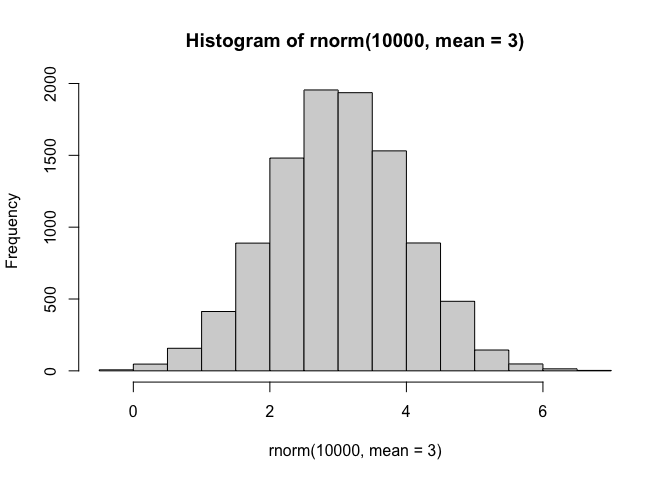

``` r
x <- c(rnorm(30, -3), rnorm(30, +3))

z <- cbind(x=x,y=rev(x))
plot(z)
```

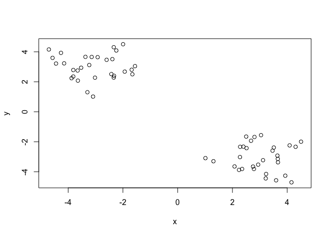

Now we can run `kmeans()` on this input `z` and see what the results
look like.

``` r
km <- kmeans(z, centers = 2)
km
```

    K-means clustering with 2 clusters of sizes 30, 30

    Cluster means:
              x         y
    1 -3.066492  3.001901
    2  3.001901 -3.066492

    Clustering vector:
     [1] 1 1 1 1 1 1 1 1 1 1 1 1 1 1 1 1 1 1 1 1 1 1 1 1 1 1 1 1 1 1 2 2 2 2 2 2 2 2
    [39] 2 2 2 2 2 2 2 2 2 2 2 2 2 2 2 2 2 2 2 2 2 2

    Within cluster sum of squares by cluster:
    [1] 44.72457 44.72457
     (between_SS / total_SS =  92.5 %)

    Available components:

    [1] "cluster"      "centers"      "totss"        "withinss"     "tot.withinss"
    [6] "betweenss"    "size"         "iter"         "ifault"      

``` r
attributes(km)
```

    $names
    [1] "cluster"      "centers"      "totss"        "withinss"     "tot.withinss"
    [6] "betweenss"    "size"         "iter"         "ifault"      

    $class
    [1] "kmeans"

> Q. How many points are in each cluster?

``` r
km$size
```

    [1] 30 30

> Q. What “componenet of your result object details cluster
> assignment/membership?

``` r
km$cluster
```

     [1] 1 1 1 1 1 1 1 1 1 1 1 1 1 1 1 1 1 1 1 1 1 1 1 1 1 1 1 1 1 1 2 2 2 2 2 2 2 2
    [39] 2 2 2 2 2 2 2 2 2 2 2 2 2 2 2 2 2 2 2 2 2 2

> Q. What “componenet of your result object details cluster center?

``` r
km$centers
```

              x         y
    1 -3.066492  3.001901
    2  3.001901 -3.066492

> Q. Plot `z` colored by the kmeans cluster assignment and add cluster
> centers as blue points

``` r
plot(z, col=c(km$cluster))
points(km$centers, col="blue", pch=15)
```

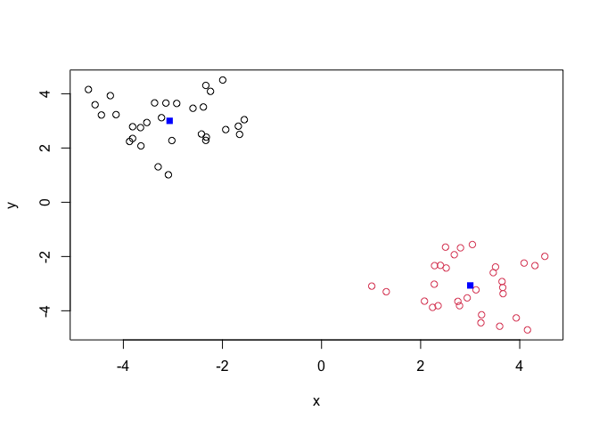

> Q. Run a K-means clustering and plot the results asking for 4 clusters
> (K=4)?

``` r
km4 <- kmeans(z, centers = 4)
plot(z, col=c(km4$cluster))
points(km4$centers, col="black", pch=15)
```

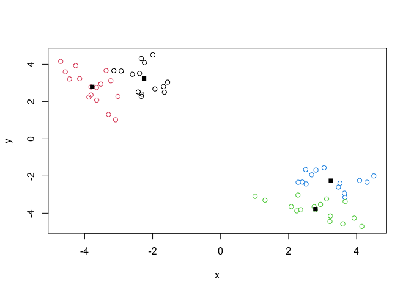

> **N.B.** You need to tell K-means the number of clusters (i.e. set
> `centers=2`)!!

One approach is to try different values for `centers` and then pick the
best…

``` r
ans <- NULL
for(i in 1:10) {
km <- kmeans(z, centers=i)
ans <- c(ans, km$tot.withinss)
}

plot(ans, type="o",xlab="Number of clusters", ylab="Total Sum of Squars Distance")
```

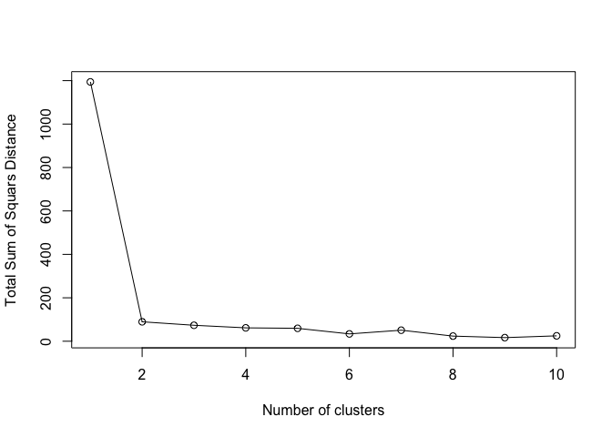

## Hierarchical Clustering

The main function in “base” R for Hierarchical Clustering is called
`hclust()`

This function does not take your “raw” data for clustering. You must
first build a “distance matrix” from your data and pass this as input to
`hclust()`

``` r
d <- dist(z)
hc <- hclust(d)
hc
```


    Call:
    hclust(d = d)

    Cluster method   : complete 
    Distance         : euclidean 
    Number of objects: 60 

There is a bespoke `plot()` method for `hclust()` result objects.

``` r
plot(hc)
abline(h=8, col="red")
```

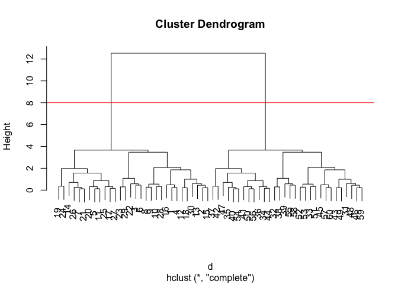

Once we have our `hclust` object (our “tree” of “cluster dendogram”) we
can *“cut”* the tree to reveal the clustering pattern.

``` r
cutree(hc, k=4)
```

     [1] 1 1 1 1 2 1 2 1 1 1 2 1 1 2 1 1 2 1 2 2 2 1 1 2 2 2 2 1 1 1 3 3 3 4 4 4 4 3
    [39] 3 4 4 4 3 4 3 3 4 3 3 4 3 3 3 4 3 4 3 3 3 3

> Q. Make a plot of `z` with your hclust results (i.e. colored by cluter
> membership)

``` r
grps <- cutree(hc, k=2)
plot(z, col=grps)
```

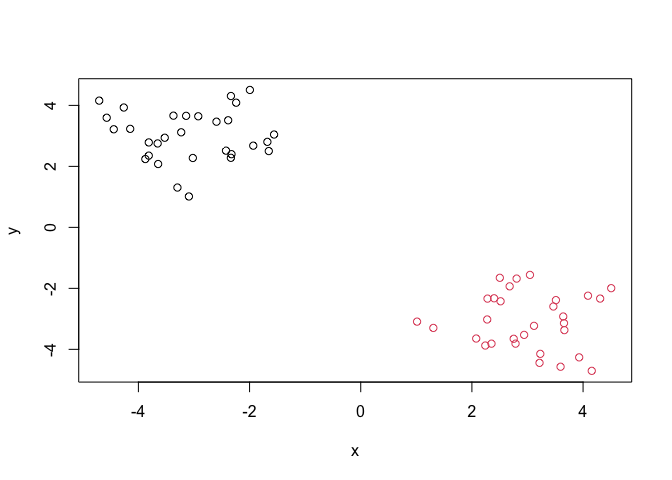

## Principal Component Analysis (PCA)

PCA is a dimensionality reduction method that is popular for revealing
patterns in complex datasets

### Analysis of UK Food Data

Let’s look at some data on the eating habits of folks from the UK to see
if there are patterns and trends that have some regions being distinct
from others.

## Data Import

The data is made available in CSV format so we can use the `read.csv()`
function for import to R:

``` r
url <- "https://tinyurl.com/UK-foods"
x <- read.csv(url)
x
```

                         X England Wales Scotland N.Ireland
    1               Cheese     105   103      103        66
    2        Carcass_meat      245   227      242       267
    3          Other_meat      685   803      750       586
    4                 Fish     147   160      122        93
    5       Fats_and_oils      193   235      184       209
    6               Sugars     156   175      147       139
    7      Fresh_potatoes      720   874      566      1033
    8           Fresh_Veg      253   265      171       143
    9           Other_Veg      488   570      418       355
    10 Processed_potatoes      198   203      220       187
    11      Processed_Veg      360   365      337       334
    12        Fresh_fruit     1102  1137      957       674
    13            Cereals     1472  1582     1462      1494
    14           Beverages      57    73       53        47
    15        Soft_drinks     1374  1256     1572      1506
    16   Alcoholic_drinks      375   475      458       135
    17      Confectionery       54    64       62        41

> Q1. How many rows and columns are in your new data frame named x? What
> R functions could you use to answer this questions?

## Complete the following code to find out how many rows and columns are in x?

``` r
# Check the dimensions of dataset (rows, columns)
dim(x)
```

    [1] 17  5

> Q2. Which approach to solving the ‘row-names problem’ mentioned above
> do you prefer and why? Is one approach more robust than another under
> certain circumstances?

## Preview the first 6 rows

``` r
# Preview first few rows of dataset
head(x)
```

                   X England Wales Scotland N.Ireland
    1         Cheese     105   103      103        66
    2  Carcass_meat      245   227      242       267
    3    Other_meat      685   803      750       586
    4           Fish     147   160      122        93
    5 Fats_and_oils      193   235      184       209
    6         Sugars     156   175      147       139

# Note how the minus indexing works

``` r
# Set first column as row names, remove first column, check updated data
rownames(x) <- x[,1]
x <- x[,-1]
head(x)
```

                   England Wales Scotland N.Ireland
    Cheese             105   103      103        66
    Carcass_meat       245   227      242       267
    Other_meat         685   803      750       586
    Fish               147   160      122        93
    Fats_and_oils      193   235      184       209
    Sugars             156   175      147       139

``` r
# Reload data with proper row names directly, preview cleaned up data
x <- read.csv(url, row.names=1)
head(x)
```

                   England Wales Scotland N.Ireland
    Cheese             105   103      103        66
    Carcass_meat       245   227      242       267
    Other_meat         685   803      750       586
    Fish               147   160      122        93
    Fats_and_oils      193   235      184       209
    Sugars             156   175      147       139

I prefer the “x \<- read.csv(url, row.names=1)” because it is cleaner
and more robust. If you run the first method multiple times, it can
cause issues because it removes the first column over again.

> Q3. Changing what optional argument in the above barplot() function
> results in the following plot?

``` r
# Create grouped barplot of food consumption
barplot(as.matrix(x), beside=T, col=rainbow(nrow(x)))
```


Change beside=TRUE to beside=FALSE to get the stacked version. The
beside=TRUE command makes grouped bars, and the beside=FALSE stacks
them.

> Q4: Changing what optional argument in the above ggplot() code results
> in a stacked barplot figure?

``` r
library(tidyr)

# Convert data to long format for ggplot with `pivot_longer()`
x_long <- x |> 
          tibble::rownames_to_column("Food") |> 
          pivot_longer(cols = -Food, 
                       names_to = "Country", 
                       values_to = "Consumption")
# Check dimensions of long dataset
dim(x_long)
```

    [1] 68  3

## \[1\] 68 3

``` r
# Create grouped bar plot
library(ggplot2)
```

## Warning: package ‘ggplot2’ was built under R version 4.4.3

``` r
# Create grouped barplot using ggplot
ggplot(x_long) +
  aes(x = Country, y = Consumption, fill = Food) +
  geom_col(position = "dodge") +
  theme_bw()
```

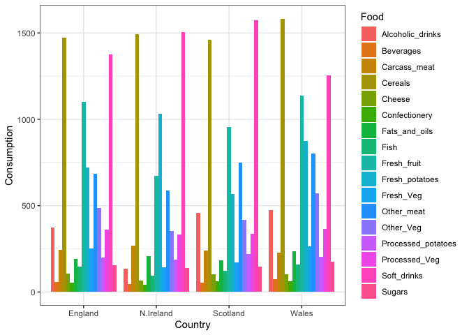

Changing geom_col(position = “dodge”) to geom_col(position = “stack”)
results in a stacked barplot figure.

> Q5. We can use the pairs() function to generate all pairwise plots for
> our countries. Can you make sense of the following code and resulting
> figure? What does it mean if a given point lies on the diagonal for a
> given plot?

``` r
# Generate pairwise scatter plots between countries
pairs(x, col=rainbow(nrow(x)), pch=16)
```

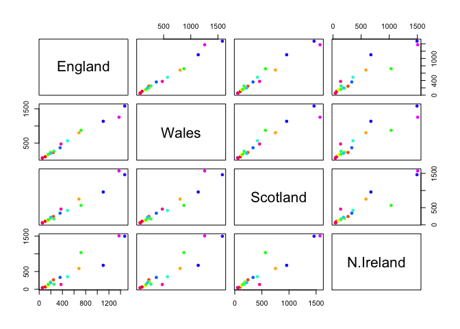

The pairs plot shows all pairwise comparisons between the country
variables. A point on the diagonal in one pairwise plot means the two
countries have the same or very similar value for that food item in that
comparison. Points that are close to a straight diagonal trend show that
the two countries have similar food-consumption patterns.

> Q6. Based on the pairs and heatmap figures, which countries cluster
> together and what does this suggest about their food consumption
> patterns? Can you easily tell what the main differences between N.
> Ireland and the other countries of the UK in terms of this data-set?

``` r
# Generate heatmap to visualize clustering patterns
library(pheatmap)

pheatmap( as.matrix(x) )
```


England, Wales, and Scotland cluster more closely together, whereas
Northern Ireland looks more distinct from the other three. This suggests
England, Wales, and Scotland have more similar overall food consumption
patterns, while Northern Ireland differs more. The exact main
differences are not super easy to see from the raw table alone.

> Q7. Complete the code below to generate a plot of PC1 vs PC2. The
> second line adds text labels over the data points.

> **Key-point**: Even relatively small datasets can prove challenging to
> interpret.

## PCA to the rescue

The main function in “base” R for PCA is called `prcomp()`. This
function wants the “observations” to be rows and the “variables” to be
columns.

So here we need to take the transpose of our `x` input object

``` r
# Perform PCA (transpose so countries are observations), then view summary statistics

pca <- prcomp(t(x))
summary(pca)
```

    Importance of components:
                                PC1      PC2      PC3       PC4
    Standard deviation     324.1502 212.7478 73.87622 2.921e-14
    Proportion of Variance   0.6744   0.2905  0.03503 0.000e+00
    Cumulative Proportion    0.6744   0.9650  1.00000 1.000e+00

## Importance of components:

## PC1 PC2 PC3 PC4

## Standard deviation 324.1502 212.7478 73.87622 2.921e-14

## Proportion of Variance 0.6744 0.2905 0.03503 0.000e+00

## Cumulative Proportion 0.6744 0.9650 1.00000 1.000e+00

``` r
# Create a data frame for plotting
df <- as.data.frame(pca$x)
df$Country <- rownames(df)

# Plot PC1 vs PC2 with ggplot
ggplot(pca$x) +
  aes(x = PC1, y = PC2, label = rownames(pca$x)) +
  geom_point(size = 3) +
  geom_text(vjust = -0.5) +
  xlim(-270, 500) +
  xlab("PC1") +
  ylab("PC2") +
  theme_bw()
```

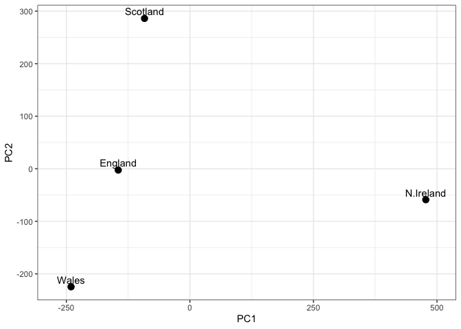

> Q8. Customize your plot so that the colors of the country names match
> the colors in our UK and Ireland map and table at start of this
> document.

``` r
# Assign custom colors to each country
df <- as.data.frame(pca$x)
df$Country <- rownames(df)
cols <- c("England" = "orange", "Wales" = "red", "Scotland" = "blue", "N.Ireland" = "darkgreen")

# Plot PCA with colored labels
ggplot(df) +
  aes(x = PC1, y = PC2, label = Country, color = Country) +
  geom_point(size = 3) +
  geom_text(vjust = 2) +
  scale_color_manual(values = cols) +
  theme_bw()
```

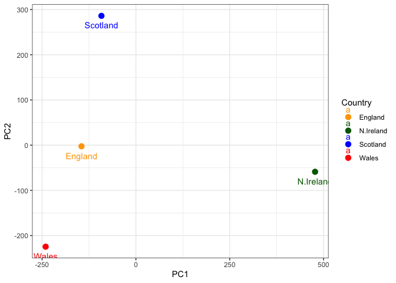

> Q9. Generate a similar ‘loadings plot’ for PC2. What two food groups
> feature prominantely and what does PC2 maninly tell us about?

``` r
# calculate how much variation in the original data each PC accounts for
v <- round( pca$sdev^2/sum(pca$sdev^2) * 100 )
v
```

    [1] 67 29  4  0

``` r
## or the second row here...
z <- summary(pca)
z$importance
```

                                 PC1       PC2      PC3          PC4
    Standard deviation     324.15019 212.74780 73.87622 2.921348e-14
    Proportion of Variance   0.67444   0.29052  0.03503 0.000000e+00
    Cumulative Proportion    0.67444   0.96497  1.00000 1.000000e+00

``` r
# Create scree plot with ggplot
variance_df <- data.frame(
  PC = factor(paste0("PC", 1:length(v)), levels = paste0("PC", 1:length(v))),
  Variance = v
)

ggplot(variance_df) +
  aes(x = PC, y = Variance) +
  geom_col(fill = "steelblue") +
  xlab("Principal Component") +
  ylab("Percent Variation") +
  theme_bw() +
  theme(axis.text.x = element_text(angle = 0))
```


``` r
# Plot PC2 loadings to identify important food variables
library(ggplot2)
ggplot(pca$rotation) +
  aes(x = PC2,
      y = reorder(rownames(pca$rotation), PC2)) +
  geom_col(fill = "steelblue") +
  xlab("PC2 Loading Score") +
  ylab("") +
  theme_bw() +
  theme(axis.text.y = element_text(size = 9))
```


The food groups that feature most in PC2 are Soft_drinks and
Alcoholic_drinks (strong positive loadings) and Fresh_potatoes and
Other_Veg (strong negative loadings). This shows that PC2 mainly
separates countries based on a contrast between processed and high-sugar
beverage consumption and more traditional staple foods like potatoes and
vegetables. Countries with higher soft drink and alcohol consumption
will have higher PC2 values, while those consuming more fresh potatoes
and vegetables will have lower PC2 values.
