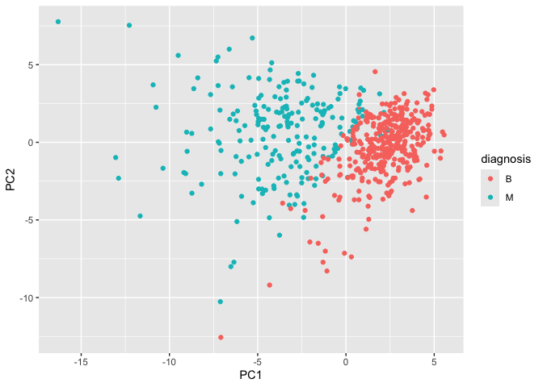
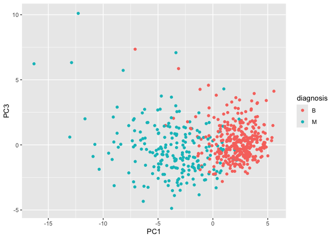
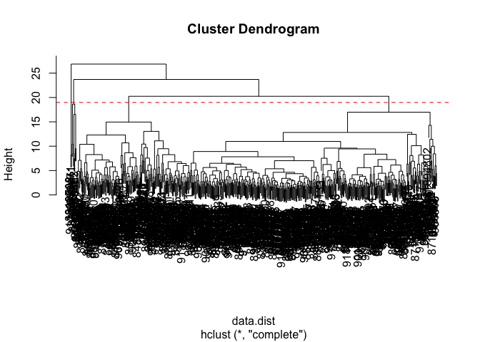
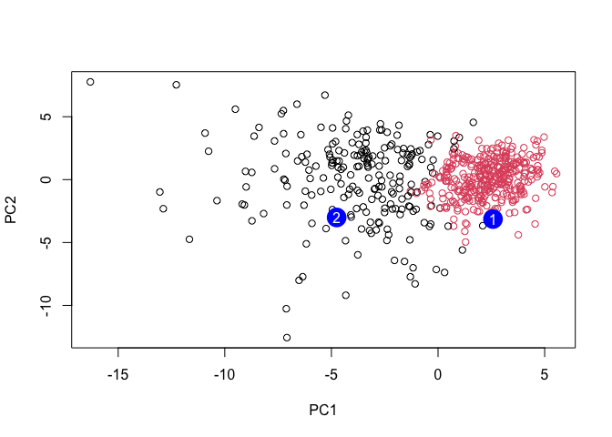

# class08
Joshua Chun (A17812847)

- [Background](#background)
- [Data Import](#data-import)
- [Exploratory data analysis](#exploratory-data-analysis)
- [Principal Component Analysis
  (PCA)](#principal-component-analysis-pca)

## Background

The goal of this mini-project is for you to explore a complete analysis
using the unsupervised learning techniques covered in class.

Today we will analyze a biopsy data-set from fine needle aspiration
(FNA) of a breast mass.

## Data Import

The data is made available as a CSV file for download. We can read this
using `read.csv()`:

``` r
# Read the Wisconsin cancer dataset from a CSV file
wisc.df <- read.csv("WisconsinCancer.csv", row.names = 1)
```

``` r
# Display the first 3 rows of the dataset
head(wisc.df, 3)
```

             diagnosis radius_mean texture_mean perimeter_mean area_mean
    842302           M       17.99        10.38          122.8      1001
    842517           M       20.57        17.77          132.9      1326
    84300903         M       19.69        21.25          130.0      1203
             smoothness_mean compactness_mean concavity_mean concave.points_mean
    842302           0.11840          0.27760         0.3001             0.14710
    842517           0.08474          0.07864         0.0869             0.07017
    84300903         0.10960          0.15990         0.1974             0.12790
             symmetry_mean fractal_dimension_mean radius_se texture_se perimeter_se
    842302          0.2419                0.07871    1.0950     0.9053        8.589
    842517          0.1812                0.05667    0.5435     0.7339        3.398
    84300903        0.2069                0.05999    0.7456     0.7869        4.585
             area_se smoothness_se compactness_se concavity_se concave.points_se
    842302    153.40      0.006399        0.04904      0.05373           0.01587
    842517     74.08      0.005225        0.01308      0.01860           0.01340
    84300903   94.03      0.006150        0.04006      0.03832           0.02058
             symmetry_se fractal_dimension_se radius_worst texture_worst
    842302       0.03003             0.006193        25.38         17.33
    842517       0.01389             0.003532        24.99         23.41
    84300903     0.02250             0.004571        23.57         25.53
             perimeter_worst area_worst smoothness_worst compactness_worst
    842302             184.6       2019           0.1622            0.6656
    842517             158.8       1956           0.1238            0.1866
    84300903           152.5       1709           0.1444            0.4245
             concavity_worst concave.points_worst symmetry_worst
    842302            0.7119               0.2654         0.4601
    842517            0.2416               0.1860         0.2750
    84300903          0.4504               0.2430         0.3613
             fractal_dimension_worst
    842302                   0.11890
    842517                   0.08902
    84300903                 0.08758

Make sure we remove or exclude the `diagnosis` column from the data-set
that we use for further analysis - this is the expert diagnosis as
either M or B:

``` r
# We can use -1 here to remove the first column and create diagnosis vector for later
wisc.data <- wisc.df[,-1]
diagnosis <- as.factor(wisc.df$diagnosis)
```

## Exploratory data analysis

> Q1. How many observations are in this dataset?

``` r
# Find number of rows (observations/samples)
nrow(wisc.data)
```

    [1] 569

> Q2. How many of the observations have a malignant diagnosis?

``` r
# Count how many are Malignant (M) vs Benign (B)
table(wisc.df$diagnosis)
```


      B   M 
    357 212 

``` r
# Count how many are Malignant (M)
sum(wisc.df$diagnosis == "M")
```

    [1] 212

> Q3. How many variables/features in the data are suffixed with \_mean?

We can use the `grep()` function to help us here:

``` r
# Return all the column names
colnames(wisc.data)
```

     [1] "radius_mean"             "texture_mean"           
     [3] "perimeter_mean"          "area_mean"              
     [5] "smoothness_mean"         "compactness_mean"       
     [7] "concavity_mean"          "concave.points_mean"    
     [9] "symmetry_mean"           "fractal_dimension_mean" 
    [11] "radius_se"               "texture_se"             
    [13] "perimeter_se"            "area_se"                
    [15] "smoothness_se"           "compactness_se"         
    [17] "concavity_se"            "concave.points_se"      
    [19] "symmetry_se"             "fractal_dimension_se"   
    [21] "radius_worst"            "texture_worst"          
    [23] "perimeter_worst"         "area_worst"             
    [25] "smoothness_worst"        "compactness_worst"      
    [27] "concavity_worst"         "concave.points_worst"   
    [29] "symmetry_worst"          "fractal_dimension_worst"

``` r
# Find column names that contain "_mean" and count matches found
length(grep("_mean", colnames(wisc.data), value = T))
```

    [1] 10

## Principal Component Analysis (PCA)

We need to scale our data before PCA with the `scale=TRUE` argument to
`prcomp()`.

``` r
wisc.pr <- prcomp(wisc.data, scale=TRUE)
summary(wisc.pr)
```

    Importance of components:
                              PC1    PC2     PC3     PC4     PC5     PC6     PC7
    Standard deviation     3.6444 2.3857 1.67867 1.40735 1.28403 1.09880 0.82172
    Proportion of Variance 0.4427 0.1897 0.09393 0.06602 0.05496 0.04025 0.02251
    Cumulative Proportion  0.4427 0.6324 0.72636 0.79239 0.84734 0.88759 0.91010
                               PC8    PC9    PC10   PC11    PC12    PC13    PC14
    Standard deviation     0.69037 0.6457 0.59219 0.5421 0.51104 0.49128 0.39624
    Proportion of Variance 0.01589 0.0139 0.01169 0.0098 0.00871 0.00805 0.00523
    Cumulative Proportion  0.92598 0.9399 0.95157 0.9614 0.97007 0.97812 0.98335
                              PC15    PC16    PC17    PC18    PC19    PC20   PC21
    Standard deviation     0.30681 0.28260 0.24372 0.22939 0.22244 0.17652 0.1731
    Proportion of Variance 0.00314 0.00266 0.00198 0.00175 0.00165 0.00104 0.0010
    Cumulative Proportion  0.98649 0.98915 0.99113 0.99288 0.99453 0.99557 0.9966
                              PC22    PC23   PC24    PC25    PC26    PC27    PC28
    Standard deviation     0.16565 0.15602 0.1344 0.12442 0.09043 0.08307 0.03987
    Proportion of Variance 0.00091 0.00081 0.0006 0.00052 0.00027 0.00023 0.00005
    Cumulative Proportion  0.99749 0.99830 0.9989 0.99942 0.99969 0.99992 0.99997
                              PC29    PC30
    Standard deviation     0.02736 0.01153
    Proportion of Variance 0.00002 0.00000
    Cumulative Proportion  1.00000 1.00000

Let’s see the “PC score plot”

``` r
library(ggplot2)

ggplot(wisc.pr$x) +
  aes(PC1, PC2, col = diagnosis) +
  geom_point()
```



> Q4. From your results, what proportion of the original variance is
> captured by the first principal component (PC1)?

``` r
summary(wisc.pr)$importance[2,1]
```

    [1] 0.44272

> Q5. How many principal components (PCs) are required to describe at
> least 70% of the original variance in the data?

``` r
# Extract the cumulative proportion of variance explained by each principal component
cumvar <- summary(wisc.pr)$importance[3,]

# Find the first principal component where cumulative variance is at least 70%
which(cumvar >= 0.70)[1]
```

    PC3 
      3 

> Q6. How many principal components (PCs) are required to describe at
> least 90% of the original variance in the data?

``` r
# Extract the cumulative proportion of variance explained by each principal component
cumvar <- summary(wisc.pr)$importance[3,]

# Find the first principal component where cumulative variance is at least 90%
which(cumvar >= 0.90)[1]
```

    PC7 
      7 

> Q7. What stands out to you about this plot? Is it easy or difficult to
> understand? Why?

``` r
biplot(wisc.pr)
```


``` r
# Plot using coordinate data, plot as a scatter plot
ggplot(wisc.pr$x) +
  aes(PC1, PC2, col = diagnosis) +
  geom_point()
```


The biplot is difficult to understand because it is crowded with too
many observation labels and variable arrows all plotted at once. This
makes it hard to see patterns or separation between groups. A simple
scatter plot of PC1 vs PC2 is much easier to interpret.

> Q8. Generate a similar plot for principal components 1 and 3. What do
> you notice about these plots?

``` r
# Repeat for components 1 and 3
ggplot(wisc.pr$x) +
  aes(PC1, PC3, col = diagnosis) +
  geom_point()
```



The PC1 vs PC3 plot shows much weaker separation between malignant and
benign samples compared to the PC1 vs PC2 plot. PC1 still separates the
groups, while PC3 does not provide much additional distinction, and the
points appear more mixed.

> Q9. For the first principal component, what is the component of the
> loading vector (i.e. wisc.pr\$rotation\[,1\]) for the feature
> concave.points_mean? This tells us how much this original feature
> contributes to the first PC. Are there any features with larger
> contributions than this one?

``` r
# Get loading value for concave.points_mean on PC1
wisc.pr$rotation["concave.points_mean", 1]
```

    [1] -0.2608538

The loading value for concave.points_mean on PC1 is large, which shows
it strongly contributes to the first principal component. However, there
are other features (such as radius_mean, perimeter_mean, and area_mean)
that have similar or slightly larger contributions.

> Q10. Using the plot() and abline() functions, what is the height at
> which the clustering model has 4 clusters?

``` r
# Scale the wisc.data data using the "scale()" function
data.scaled <- scale(wisc.data)
```

``` r
# Calculate Euclidean distance between all observations
data.dist <- dist(data.scaled)
```

``` r
# Perform hierarchical clustering using complete linkage
wisc.hclust <- hclust(data.dist, method = "complete")
```

``` r
# Plot dendrogram
plot(wisc.hclust)

# Draw horizontal line where ~4 clusters appear
abline(h = 19, col = "red", lty = 2)
```



``` r
# Cut the dendrogram into 4 clusters
wisc.hclust.clusters <- cutree(wisc.hclust, k = 4)
```

``` r
# Compare clusters to true labels
table(wisc.hclust.clusters, diagnosis)
```

                        diagnosis
    wisc.hclust.clusters   B   M
                       1  12 165
                       2   2   5
                       3 343  40
                       4   0   2

The clustering model has approximately 4 clusters at a height of around
19–20.

> Q12. Which method gives your favorite results for the same data.dist
> dataset? Explain your reasoning.

``` r
# Try different hierarchical clustering methods
hc.single <- hclust(data.dist, method = "single")
hc.complete <- hclust(data.dist, method = "complete")
hc.average <- hclust(data.dist, method = "average")
hc.ward <- hclust(data.dist, method = "ward.D2")

# Compare how each method separates diagnosis using 4 clusters
table(cutree(hc.single, k = 4), diagnosis)
```

       diagnosis
          B   M
      1 356 209
      2   1   0
      3   0   2
      4   0   1

``` r
table(cutree(hc.complete, k = 4), diagnosis)
```

       diagnosis
          B   M
      1  12 165
      2   2   5
      3 343  40
      4   0   2

``` r
table(cutree(hc.average, k = 4), diagnosis)
```

       diagnosis
          B   M
      1 355 209
      2   2   0
      3   0   1
      4   0   2

``` r
table(cutree(hc.ward, k = 4), diagnosis)
```

       diagnosis
          B   M
      1   0 115
      2   6  48
      3 337  48
      4  14   1

My favorite method is ward.D2 because it gives more balanced and
biologically meaningful clusters compared to the other methods. Since
ward.D2 minimizes the variance within clusters, it tends to group
samples that are more similar overall. This makes sense for this data
set because malignant and benign samples should cluster based on similar
nucleus measurements. Overall, it gives clearer separation between
malignant and benign diagnoses than methods like single linkage, which
can create messier chained clusters.

> Q13. How well does the newly created hclust model with two clusters
> separate out the two “M” and “B” diagnoses?

``` r
# 1. Create clustering model using first 7 PCs
wisc.pr.hclust <- hclust(dist(wisc.pr$x[,1:7]), method = "ward.D2")

# 2. Cut into 2 clusters
wisc.pr.hclust.clusters <- cutree(wisc.pr.hclust, k = 2)

# 3. Now compare to diagnosis
table(wisc.pr.hclust.clusters, diagnosis)
```

                           diagnosis
    wisc.pr.hclust.clusters   B   M
                          1  28 188
                          2 329  24

The PCA-based hierarchical clustering separates the data very well into
two clusters. One cluster contains mostly malignant samples (188 M vs 28
B), while the other contains mostly benign samples (329 B vs 24 M). This
indicates strong separation with relatively few mismatches.

> Q14. How well do the hierarchical clustering models you created in the
> previous sections (i.e. without first doing PCA) do in terms of
> separating the diagnoses? Again, use the table() function to compare
> the output of each model (wisc.hclust.clusters and
> wisc.pr.hclust.clusters) with the vector containing the actual
> diagnoses.

``` r
table(wisc.hclust.clusters, diagnosis)
```

                        diagnosis
    wisc.hclust.clusters   B   M
                       1  12 165
                       2   2   5
                       3 343  40
                       4   0   2

The hierarchical clustering without PCA performs worse at separating the
diagnoses. The clusters are less cleanly divided, with more mixing of
malignant and benign samples across multiple clusters. Compared to the
PCA-based clustering, this is less effective at clearly distinguishing
between the two groups.

> Q16. Which of these new patients should we prioritize for follow up
> based on your results?

``` r
grps <- cutree(wisc.pr.hclust, k = 2)
# Read in new patient samples
url <- "https://tinyurl.com/new-samples-CSV"
new <- read.csv(url)

# Project new samples onto the PCA model
npc <- predict(wisc.pr, newdata = new)

# Plot original samples using PC1 and PC2
plot(wisc.pr$x[,1:2], col = grps)

# Add new patient samples as large blue points
points(npc[,1], npc[,2], col = "blue", pch = 16, cex = 3)

# Label the two new samples
text(npc[,1], npc[,2], c(1, 2), col = "white")
```



Patient 2 should be prioritized for follow-up because it clusters with
the malignant samples in PCA space, while Patient 1 clusters with the
benign group.
